# -PR4.5.-eefactorizando-en-eclipse

En Eclipse la refactorización queda resumida en el menú Refactor. Documenta, a ser posible en tu propio código del módulo de programación,  su uso en los siguientes casos:

**1. Renombrar métodos**

Le damos click derecho sobre el método, Refactor > Extract Method...
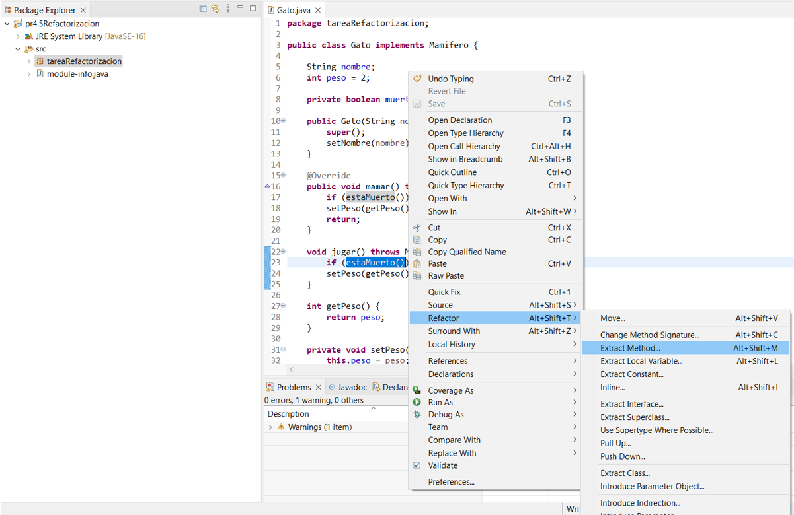

Escribimos el nuevo nombre que queramos darle al método y le damos a "OK" para que se realice el cambio
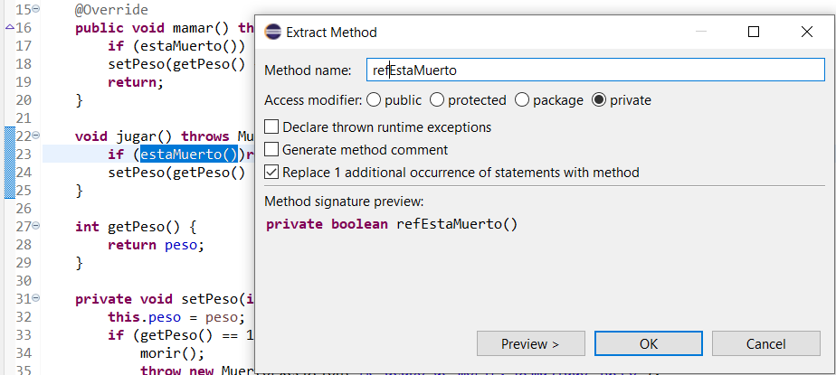

Podemos ver como en todos los métodos que antes se llamaban "estaMuerto" ahora se llaman "redEstaMuerto"
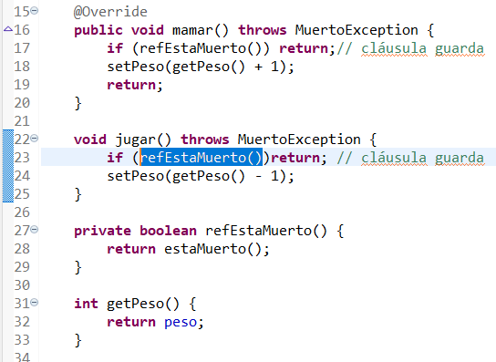

**2. Renombrar paquetes**

Le damos en el paquete click derecho y:
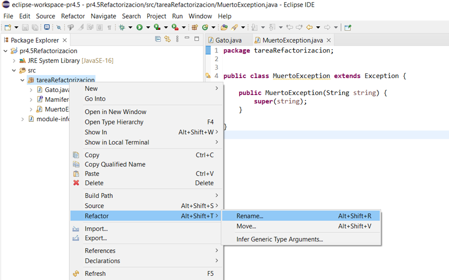

Ponemos el nuevo nombre que queramos darle al paquete
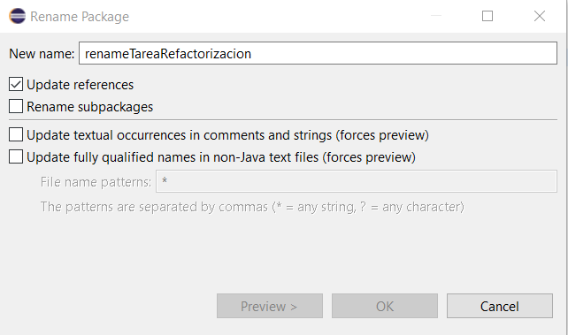

Podemos observar como se ha cambiado el nombre tanto en el paquete como en los documentos que usan ese paquete de referencia
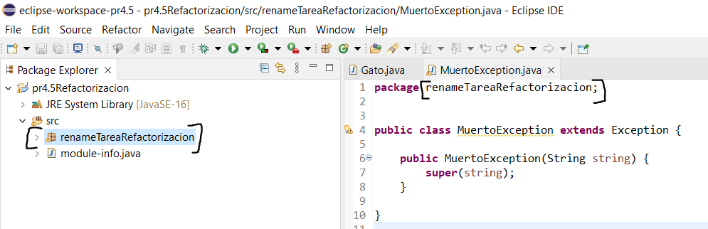

**3. Encapsula campo**

Click derecho sobre el campo que queramos encapsular y:
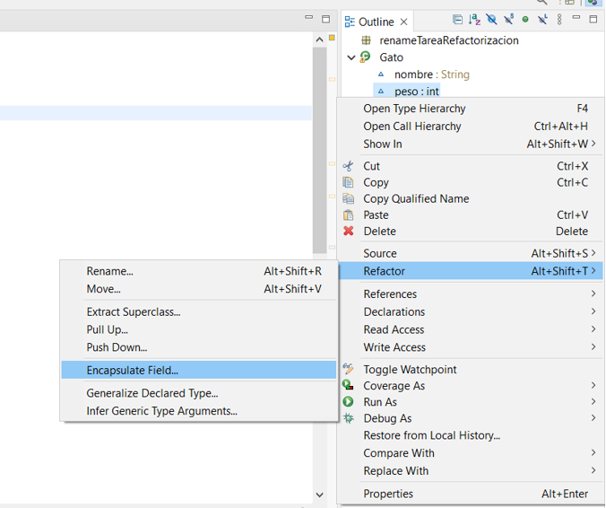

Seleccionamos si queremos los setters, los getters, o ambos
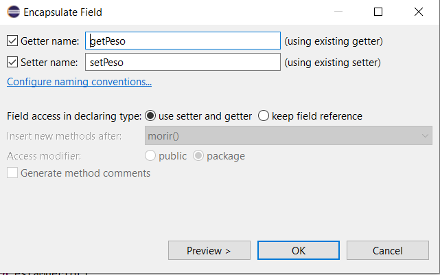

Podemos observar como ha emcapsulado el peso (antes era simplemente peso++/peso--)
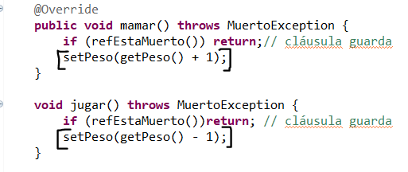

**4. Extrae clase**

Click derecho en el documento y:
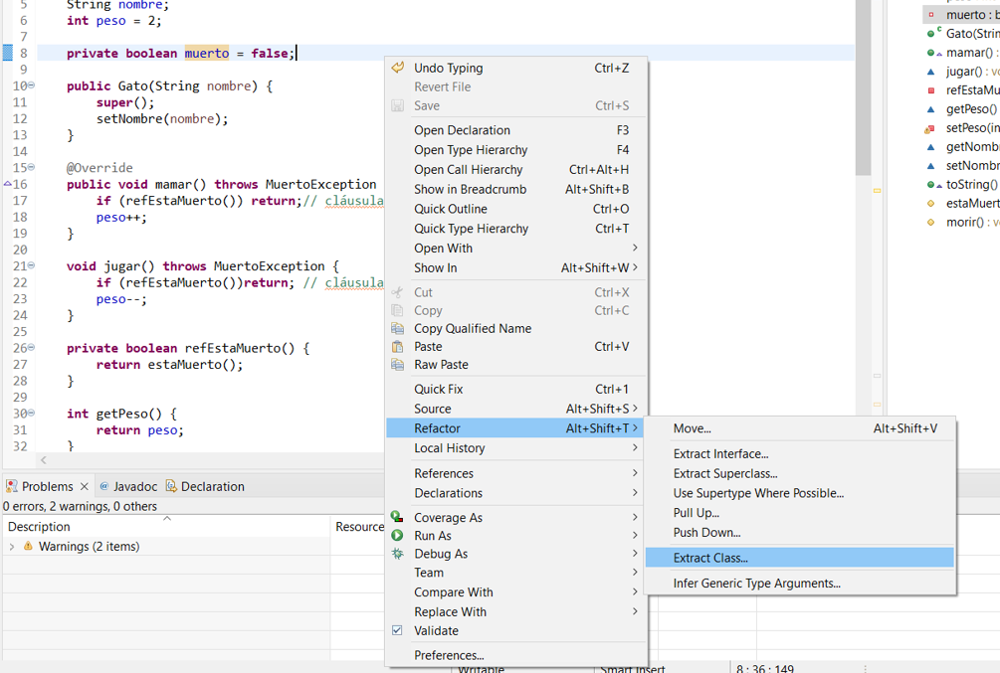

Extraemos la clase con los datos que veamos convenientes
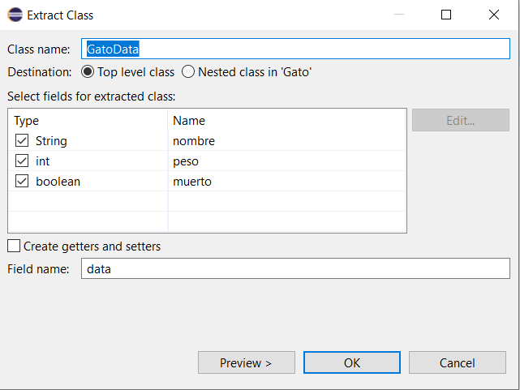

Podemos ver como nos genera otro documento con el nombre que le hemos dado y con los datos que hemos escogido
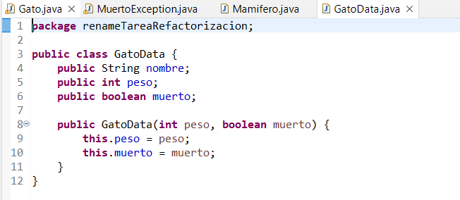

**5. Extrae interface**

**6. Extrae constante**

**7. Extrae método**

**8. Extrae variable local**

**9. Todo en una línea (inlining)**

**10. Subir/bajar (pull up/push down)**