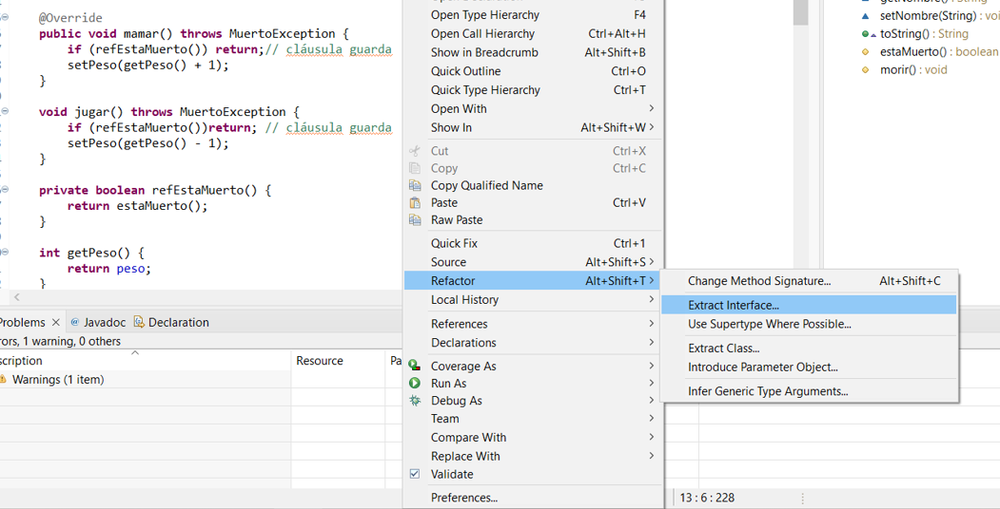
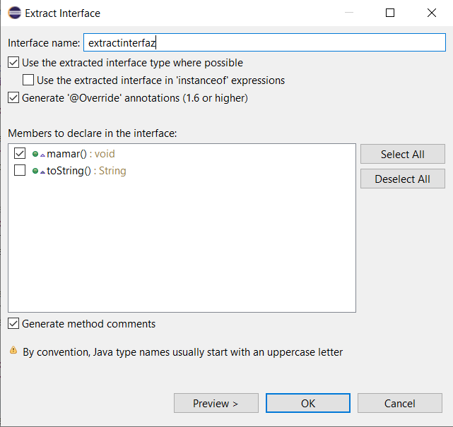
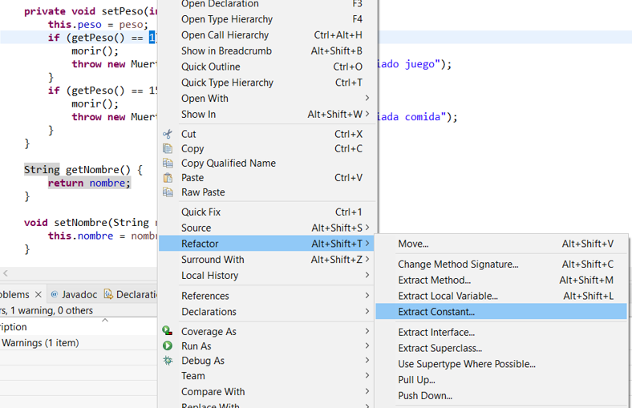
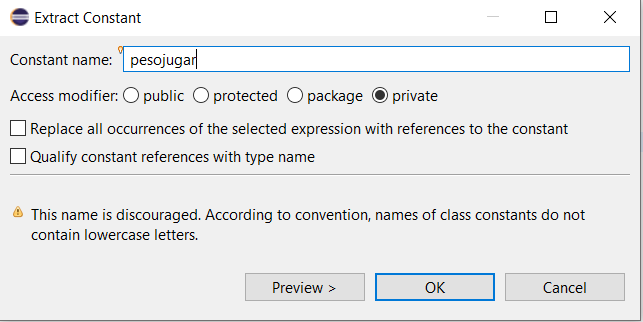
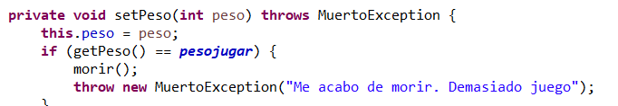

# -PR4.5.-eefactorizando-en-eclipse

En Eclipse la refactorización queda resumida en el menú Refactor. Documenta, a ser posible en tu propio código del módulo de programación,  su uso en los siguientes casos:

**1. Renombrar métodos**

Le damos click derecho sobre el método, Refactor > Extract Method...

Escribimos el nuevo nombre que queramos darle al método y le damos a "OK" para que se realice el cambio

Podemos ver como en todos los métodos que antes se llamaban "estaMuerto" ahora se llaman "redEstaMuerto"

**2. Renombrar paquetes**

Le damos en el paquete click derecho y:

Ponemos el nuevo nombre que queramos darle al paquete

Podemos observar como se ha cambiado el nombre tanto en el paquete como en los documentos que usan ese paquete de referencia

**3. Encapsula campo**

Click derecho sobre el campo que queramos encapsular y:

Seleccionamos si queremos los setters, los getters, o ambos

Podemos observar como ha emcapsulado el peso (antes era simplemente peso++/peso--)

**4. Extrae clase**

Click derecho en el documento y:

Extraemos la clase con los datos que decidamos

Podemos ver como nos genera otro documento con el nombre que le hemos dado y con los datos que hemos escogido

**5. Extrae interface**

Click derecho en el documento y:

Extraemos la interfaz con el nombre y datos que decidamos

Podemos observar como nos genera otro documento con el nombre y datos que hemos asignado

**6. Extrae constante**

Seleccionamos el dato que queramos tomar como constante (normalmente es un dato que se vaya a repetir varias veces, asi cuando queramos cambiar su valor solo lo cambiamos en la constante, y ya afecta a todo el documento) y:

Le damos el nombre que encontremos mas adecuado:

Podemos observar como al inicio de nuestro documento nos sale la constante y su valor

Antes aquí nos salía el valor de la constante (1), ahora nos sale el nombre que le hemos asignado

**7. Extrae método**

**8. Extrae variable local**

**9. Todo en una línea (inlining)**

**10. Subir/bajar (pull up/push down)**